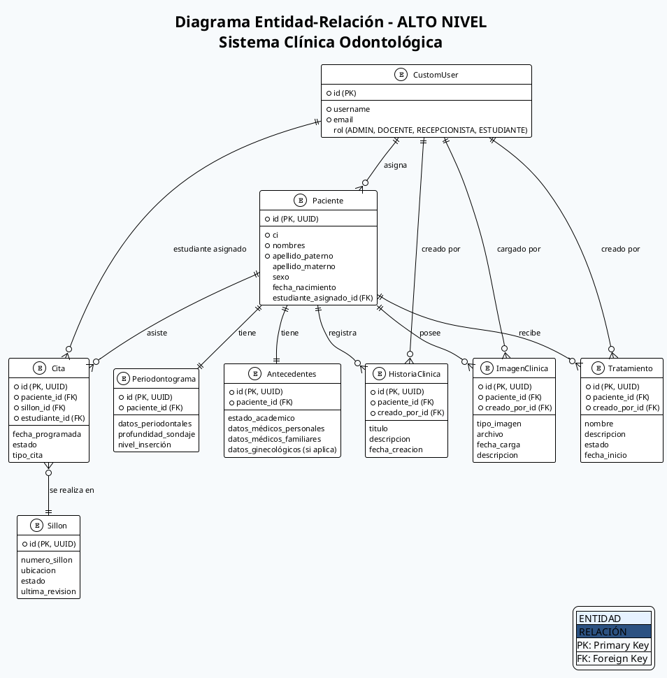

# 🗄️ Diagramas Entidad-Relación (ER) - PlantUML

---

## DIAGRAMA DE ALTO NIVEL (Modelo Conceptual)



---

## DIAGRAMA DE BAJO NIVEL (Modelo Lógico Detallado)

```plantuml
@startuml Bajo_Nivel_ER
!theme plain
skinparam backgroundColor #F7FAFC
skinparam entityBackgroundColor #BEE3F8
skinparam entityBorderColor #2C5282
skinparam relationshipFontSize 9
skinparam defaultFontSize 10

title Diagrama Entidad-Relación - BAJO NIVEL\nSistema Clínica Odontológica - Modelo Detallado

entity "CustomUser" as User {
  * id : BIGINT [PK]
  * username : VARCHAR(150) [UNIQUE]
  * email : VARCHAR(254)
  * first_name : VARCHAR(150)
  * last_name : VARCHAR(150)
  * password : VARCHAR(128)
  * is_staff : BOOLEAN
  * is_active : BOOLEAN
  * is_superuser : BOOLEAN
  * date_joined : DATETIME
  * last_login : DATETIME [NULL]
  * rol : VARCHAR(20) [CHOICE]
}

entity "Paciente" as Paciente {
  * id : UUID [PK]
  * ci : VARCHAR(20) [UNIQUE]
  * nombres : VARCHAR(100)
  * apellido_paterno : VARCHAR(100)
  * apellido_materno : VARCHAR(100) [NULL]
  * sexo : VARCHAR(20)
  * fecha_nacimiento : DATE
  * lugar_nacimiento : VARCHAR(150) [NULL]
  * estado_civil : VARCHAR(50) [NULL]
  * ocupacion : VARCHAR(150) [NULL]
  * direccion : TEXT [NULL]
  * celular : VARCHAR(20) [NULL]
  * telefono : VARCHAR(20) [NULL]
  * contacto_emergencia : VARCHAR(150) [NULL]
  * telefono_emergencia : VARCHAR(20) [NULL]
  * fecha_ultima_consulta : DATE [NULL]
  * motivo_ultima_consulta : TEXT [NULL]
  * inasistencias : INT [DEFAULT=0]
  * alerta_abandono : BOOLEAN [DEFAULT=False]
  * creado_en : DATETIME
  * actualizado_en : DATETIME
  * activo : BOOLEAN [DEFAULT=True]
  * estudiante_asignado_id : BIGINT [FK] [NULL]
}

entity "AntecedentePatologicoFamiliar" as AntPatFam {
  * id : UUID [PK]
  * paciente_id : UUID [FK] [UNIQUE]
  * estudiante_id : BIGINT [FK]
  * docente_supervisor_id : BIGINT [FK] [NULL]
  * estado_academico : VARCHAR(20)
  * alergia : BOOLEAN
  * alergia_familiar : VARCHAR(150) [NULL]
  * alergia_obs : TEXT [NULL]
  * asma_bronquial : BOOLEAN
  * cardiologicos : BOOLEAN
  * oncologicos : BOOLEAN
  * discrasias_sanguineas : BOOLEAN
  * diabetes : BOOLEAN
  * hipertension_arterial : BOOLEAN
  * renales : BOOLEAN
  * comentarios_docente : TEXT [NULL]
  * fecha_aprobacion : DATETIME [NULL]
  * creado_en : DATETIME
  * actualizado_en : DATETIME
}

entity "AntecedentePatologicoPersonal" as AntPatPer {
  * id : UUID [PK]
  * paciente_id : UUID [FK] [UNIQUE]
  * estudiante_id : BIGINT [FK]
  * docente_supervisor_id : BIGINT [FK] [NULL]
  * estado_academico : VARCHAR(20)
  * estado_salud : VARCHAR(100) [NULL]
  * fecha_ultimo_examen_medico : DATE [NULL]
  * bajo_tratamiento_medico : BOOLEAN
  * toma_medicamentos : BOOLEAN
  * sangra_excesivamente : BOOLEAN
  * problema_sanguineo : BOOLEAN
  * anemia : BOOLEAN
  * leucemia : BOOLEAN
  * hemofilia : BOOLEAN
  * transfusion_sanguinea : BOOLEAN
  * intervencion_quirurgica : BOOLEAN
  * hepatitis : BOOLEAN
  * tension_arterial : BOOLEAN
  * aftas_herpes : BOOLEAN
  * vih_positivo : BOOLEAN
  * alergia_penicilina : BOOLEAN
  * alergia_anestesia : BOOLEAN
  * creado_en : DATETIME
  * actualizado_en : DATETIME
}

entity "AntecedenteNoPatologicoPersonal" as AntNoPatPer {
  * id : UUID [PK]
  * paciente_id : UUID [FK] [UNIQUE]
  * estudiante_id : BIGINT [FK]
  * docente_supervisor_id : BIGINT [FK] [NULL]
  * respira_boca : BOOLEAN
  * consume_citricos : BOOLEAN
  * muerde_unas_labios : BOOLEAN
  * muerde_objetos : BOOLEAN
  * apretamiento_dentario : BOOLEAN
  * fuma : BOOLEAN
  * fuma_cantidad_diaria : VARCHAR(100) [NULL]
  * estado_academico : VARCHAR(20)
  * comentarios_docente : TEXT [NULL]
  * fecha_aprobacion : DATETIME [NULL]
  * creado_en : DATETIME
  * actualizado_en : DATETIME
}

entity "AntecedenteGinecologico" as AntGineco {
  * id : UUID [PK]
  * paciente_id : UUID [FK] [UNIQUE]
  * estudiante_id : BIGINT [FK]
  * docente_supervisor_id : BIGINT [FK] [NULL]
  * posibilidad_embarazo : BOOLEAN
  * embarazo_meses : VARCHAR(50) [NULL]
  * toma_anticonceptivos : BOOLEAN
  * estado_academico : VARCHAR(20)
  * comentarios_docente : TEXT [NULL]
  * fecha_aprobacion : DATETIME [NULL]
  * creado_en : DATETIME
  * actualizado_en : DATETIME
}

entity "Habitos" as Habitos {
  * id : BIGINT [PK]
  * paciente_id : UUID [FK] [UNIQUE]
  * estudiante_id : BIGINT [FK]
  * docente_supervisor_id : BIGINT [FK] [NULL]
  * tecnica_cepillado : VARCHAR(255) [NULL]
  * elementos_higiene : VARCHAR(255) [NULL]
  * onicofagia : BOOLEAN
  * interposicion_lingual : BOOLEAN
  * bruxismo : BOOLEAN
  * bruxomania : BOOLEAN
  * succiona_citricos : BOOLEAN
  * respirador_bucal : BOOLEAN
  * fuma : BOOLEAN
  * bebe : BOOLEAN
  * interposicion_objetos : BOOLEAN
  * otros_habitos : TEXT [NULL]
  * estado_academico : VARCHAR(20)
  * comentarios_docente : TEXT [NULL]
  * fecha_aprobacion : DATETIME [NULL]
}

entity "AntecedentesPeriodontales" as AntPeriod {
  * id : BIGINT [PK]
  * paciente_id : UUID [FK] [UNIQUE]
  * estudiante_id : BIGINT [FK]
  * docente_supervisor_id : BIGINT [FK] [NULL]
  * sangrado_espontaneo : BOOLEAN
  * sangrado_provocado : BOOLEAN
  * movilidad : BOOLEAN
  * se_han_separado : BOOLEAN
  * se_han_elongado : BOOLEAN
  * halitosis : BOOLEAN
  * estado_academico : VARCHAR(20)
  * comentarios_docente : TEXT [NULL]
  * fecha_aprobacion : DATETIME [NULL]
}

entity "Cita" as Cita {
  * id : UUID [PK]
  * paciente_id : UUID [FK]
  * sillon_id : UUID [FK]
  * estudiante_id : BIGINT [FK]
  * docente_id : BIGINT [FK] [NULL]
  * fecha_programada : DATETIME
  * estado : VARCHAR(20) [CHOICE]
  * tipo_cita : VARCHAR(50)
  * motivo : TEXT [NULL]
  * observaciones : TEXT [NULL]
  * creado_en : DATETIME
  * actualizado_en : DATETIME
}

entity "Tratamiento" as Tratamiento {
  * id : UUID [PK]
  * paciente_id : UUID [FK]
  * creado_por_id : BIGINT [FK]
  * docente_supervisor_id : BIGINT [FK] [NULL]
  * nombre : VARCHAR(255)
  * descripcion : TEXT
  * plan_detallado : TEXT [NULL]
  * estado : VARCHAR(20) [CHOICE]
  * estado_academico : VARCHAR(20)
  * fecha_inicio : DATE
  * fecha_finalizacion_estimada : DATE [NULL]
  * fecha_finalizacion : DATE [NULL]
  * duracion_estimada_horas : INT [NULL]
  * costo_estimado : DECIMAL(10,2) [NULL]
  * comentarios_docente : TEXT [NULL]
  * fecha_aprobacion : DATETIME [NULL]
  * creado_en : DATETIME
  * actualizado_en : DATETIME
}

entity "ImagenClinica" as Imagen {
  * id : UUID [PK]
  * paciente_id : UUID [FK]
  * creado_por_id : BIGINT [FK]
  * archivo : ImageField
  * tipo_imagen : VARCHAR(50)
  * fecha_carga : DATETIME
  * descripcion : TEXT [NULL]
  * notas_clinicas : TEXT [NULL]
  * es_dicom : BOOLEAN
  * activo : BOOLEAN
}

entity "Periodontograma" as Periodontograma {
  * id : UUID [PK]
  * paciente_id : UUID [FK] [UNIQUE]
  * creado_por_id : BIGINT [FK]
  * estudiante_id : BIGINT [FK]
  * docente_supervisor_id : BIGINT [FK] [NULL]
  * datos_json : JSON
  * profundidad_sondaje_promedio : DECIMAL(5,2) [NULL]
  * nivel_insercion_promedio : DECIMAL(5,2) [NULL]
  * estado_academico : VARCHAR(20)
  * comentarios_docente : TEXT [NULL]
  * fecha_aprobacion : DATETIME [NULL]
  * creado_en : DATETIME
  * actualizado_en : DATETIME
}

entity "HistoriaClinica" as Historia {
  * id : UUID [PK]
  * paciente_id : UUID [FK]
  * creado_por_id : BIGINT [FK]
  * titulo : VARCHAR(255)
  * descripcion : TEXT
  * fecha_creacion : DATETIME
  * activo : BOOLEAN
}

entity "Sillon" as Sillon {
  * id : UUID [PK]
  * numero_sillon : INT
  * ubicacion : VARCHAR(100)
  * estado : VARCHAR(20) [CHOICE]
  * estado_mantenimiento : VARCHAR(20) [CHOICE]
  * fecha_ultima_revision : DATETIME
  * notas_mantenimiento : TEXT [NULL]
  * creado_en : DATETIME
  * actualizado_en : DATETIME
}

entity "RevisionSillon" as RevisionSillon {
  * id : UUID [PK]
  * sillon_id : UUID [FK]
  * realizado_por_id : BIGINT [FK]
  * tipo_revision : VARCHAR(50)
  * descripcion : TEXT
  * resultado : VARCHAR(20)
  * fecha_revision : DATETIME
  * proximo_mantenimiento : DATE [NULL]
}

entity "AvanceClinico" as AvanceClinico {
  * id : UUID [PK]
  * estudiante_id : BIGINT [FK]
  * paciente_id : UUID [FK]
  * docente_supervisor_id : BIGINT [FK]
  * cita_id : UUID [FK]
  * tratamiento_id : UUID [FK] [NULL]
  * tipo_avance : VARCHAR(50)
  * descripcion : TEXT
  * evidencias_fotos : JSON [NULL]
  * estado : VARCHAR(20)
  * calificacion : INT [NULL]
  * observaciones_docente : TEXT [NULL]
  * fecha_creacion : DATETIME
  * fecha_aprobacion : DATETIME [NULL]
}

Paciente }o--|| User: "asignado a (estudiante)"
AntPatFam }o--|| Paciente: "refiere a"
AntPatPer }o--|| Paciente: "refiere a"
AntNoPatPer }o--|| Paciente: "refiere a"
AntGineco }o--|| Paciente: "refiere a"
Habitos }o--|| Paciente: "refiere a"
AntPeriod }o--|| Paciente: "refiere a"

Cita }o--|| Paciente: "agenda"
Cita }o--|| Sillon: "en"
Cita }o--|| User: "estudiante realiza"

Tratamiento }o--|| Paciente: "para"
Tratamiento }o--|| User: "creado por"

Imagen }o--|| Paciente: "de"
Imagen }o--|| User: "capturada por"

Periodontograma }o--|| Paciente: "de"
Periodontograma }o--|| User: "realizado por"

Historia }o--|| Paciente: "registra"
Historia }o--|| User: "creada por"

RevisionSillon }o--|| Sillon: "revisa"
RevisionSillon }o--|| User: "realizado por"

AvanceClinico }o--|| Paciente: "progreso de"
AvanceClinico }o--|| User: "estudiante"
AvanceClinico }o--|| Cita: "en"

AntPatFam }o--|| User: "estudiante"
AntPatPer }o--|| User: "estudiante"
AntNoPatPer }o--|| User: "estudiante"
AntGineco }o--|| User: "estudiante"
Habitos }o--|| User: "estudiante"
AntPeriod }o--|| User: "estudiante"
Periodontograma }o--|| User: "estudiante"

legend right
  |<#BEE3F8> ENTIDAD |
  |<#2C5282> ATRIBUTO |
  |PK: Primary Key |
  |FK: Foreign Key |
  |UNIQUE: Campo único |
  |CHOICE: Enum field |
  |NULL: Campo opcional |
endlegend

@enduml
```



---

## 📊 LEYENDA DE ATRIBUTOS

### Tipos de Datos
- **UUID** - Identificador universal único
- **BIGINT** - Entero largo (Django auto ID)
- **VARCHAR(n)** - Texto con límite de caracteres
- **TEXT** - Texto sin límite
- **DATE** - Fecha (YYYY-MM-DD)
- **DATETIME** - Fecha y hora
- **BOOLEAN** - Verdadero/Falso
- **INT** - Entero
- **DECIMAL(10,2)** - Número decimal
- **JSON** - Datos estructurados
- **ImageField** - Campo de archivo

### Cardinalidades
- **||** - Uno a uno
- **}o** - Cero o muchos
- **o{** - Uno o muchos

### Opciones de Estado

#### estado_academico (Antecedentes)
- BORRADOR
- REVISION
- APROBADO
- RECHAZADO

#### estado (Cita)
- PROGRAMADA
- CONFIRMADA
- CANCELADA
- COMPLETADA
- NO_ASISTENCIA

#### estado (Tratamiento)
- PLANIFICADO
- EN_PROGRESO
- PAUSADO
- COMPLETADO
- CANCELADO

#### estado (Sillon)
- DISPONIBLE
- EN_USO
- MANTENIMIENTO
- FUERA_SERVICIO

---

## 🔑 RELACIONES CLAVE

### Herencia (SeguimientoAcademico)
- `AntecedentePatologicoFamiliar`
- `AntecedentePatologicoPersonal`
- `AntecedenteNoPatologicoPersonal`
- `AntecedenteGinecologico`
- `Habitos`
- `AntecedentesPeriodontales`
- `Tratamiento`
- `Periodontograma`

Todas heredan de una clase abstracta con campos:
- `estudiante`
- `docente_supervisor`
- `estado_academico`
- `comentarios_docente`
- `fecha_aprobacion`

### Índices Importantes
- `Paciente.ci` - UNIQUE
- `Paciente.estudiante_asignado_id` - FK con restricción
- `Cita.fecha_programada` - Para filtros por fecha
- `CustomUser.username` - UNIQUE

---

## 💾 INSTRUCCIONES DE USO

### Compilar en PlantUML Online
1. Ve a: https://www.plantuml.com/plantuml/uml/
2. Copia el código del diagrama
3. Visualiza instantáneamente

### En VSCode
1. Instala: "PlantUML" (jebbs.plantuml)
2. Click derecho → "Preview Current Diagram"

### Exportar a Imagen
```bash
# Instalación
npm install -g plantuml

# Generar PNG
plantuml DIAGRAMAS_PLANTUML.md -o output/
```

