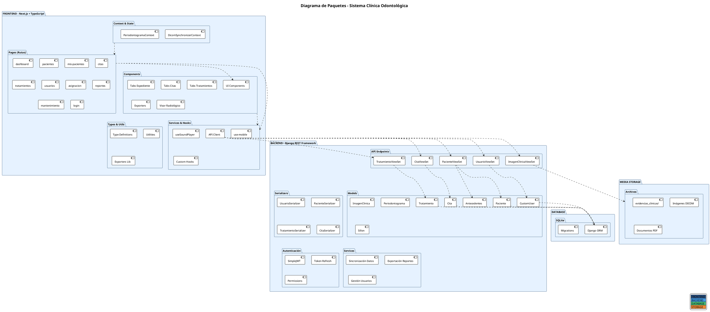

# 📊 Diagramas PlantUML - Sistema Clínica Odontológica

---

## 1. DIAGRAMA DE PAQUETES



---

## 2. DIAGRAMA DE COLABORACIÓN / COMUNICACIÓN

```plantuml
@startuml Diagrama_Colaboracion
!theme plain
skinparam actorBorderColor #2C5282
skinparam actorBackgroundColor #E6F2FF
skinparam databaseBorderColor #48BB78
skinparam databaseBackgroundColor #C6F6D5
skinparam componentBorderColor #4299E1
skinparam componentBackgroundColor #BEE3F8

title Diagrama de Colaboración - Flujo de Interacción

actor Usuario

participant "Frontend\n(Next.js)" as FE
participant "API REST\n(Django)" as API
participant "Modelos ORM\n(Django)" as Models
database "SQLite\nDatabase" as DB
participant "Media\nStorage" as Storage

Usuario -->+ FE: 1. Ingresa credenciales (login)
FE -->+ API: 2. POST /api/login/ (credentials)
API --> API: 3. Validar usuario
API -->+ Models: 4. Consultar CustomUser
Models -->+ DB: 5. SELECT * WHERE username
DB -->> Models: 6. Retorna usuario
Models -->> API: 7. Usuario encontrado
API --> API: 8. Generar JWT Token
API -->> FE: 9. Retorna {access_token, refresh_token}
FE -->> Usuario: 10. Redirige a Dashboard

Usuario -->+ FE: 11. Navega a Pacientes
FE -->+ API: 12. GET /api/pacientes/ \n(Authorization: Bearer token)
API --> API: 13. Verificar JWT Token
API --> API: 14. Aplicar filtros por rol
API -->+ Models: 15. QuerySet Pacientes filtrado
Models -->+ DB: 16. SELECT * FROM pacientes
DB -->> Models: 17. Retorna lista de pacientes
Models -->> API: 18. Serializar datos
API -->> FE: 19. Retorna JSON array
FE --> FE: 20. Renderizar tabla de pacientes
FE -->> Usuario: 21. Muestra tabla interactiva

Usuario -->+ FE: 22. Hace clic en "Nuevo Paciente"
FE --> FE: 23. Abre formulario modal
Usuario -->+ FE: 24. Completa datos y envía
FE -->+ API: 25. POST /api/pacientes/ (data)
API --> API: 26. Validar serializer
API -->+ Models: 27. Crear nuevo Paciente
Models -->+ DB: 28. INSERT INTO pacientes
DB -->> Models: 29. UUID generado
Models -->> API: 30. Paciente creado
API -->> FE: 31. Retorna paciente creado
FE --> FE: 32. Actualiza lista
FE -->> Usuario: 33. Muestra éxito

Usuario -->+ FE: 34. Abre expediente del paciente
FE -->+ API: 35. GET /api/pacientes/{id}/
API -->+ Models: 36. Obtener Paciente + Antecedentes
Models -->+ DB: 37. JOINs y consultas relacionadas
DB -->> Models: 38. Datos completos
Models -->> API: 39. Serializar relaciones
API -->> FE: 40. JSON con datos relacionados
FE --> FE: 41. Cargar tabs (General, Odontopediatría, etc)
FE -->> Usuario: 42. Muestra expediente completo

Usuario -->+ FE: 43. Carga imágenes radiológicas
FE -->+ Storage: 44. Upload imágenes (multipart)
Storage -->+ API: 45. Crear ImagenClinica record
API -->+ Models: 46. INSERT ImagenClinica
Models -->+ DB: 47. Guardar metadata
DB -->> Models: 48. Confirmación
Models -->> API: 49. ImagenClinica creada
API -->> Storage: 50. Archivo almacenado
Storage -->> FE: 51. URL de imagen
FE --> FE: 52. Renderizar en Visor Radiológico
FE -->> Usuario: 53. Muestra comparador de imágenes

@enduml
```

---

## 3. MAPA NAVEGACIONAL DEL SISTEMA

```plantuml
@startuml Mapa_Navegacional
!theme plain
skinparam backgroundColor #F7FAFC
skinparam arrowColor #2C5282
skinparam nodeBackgroundColor #E6F2FF
skinparam nodeBorderColor #2C5282

title Mapa Navegacional - Sistema Clínica Odontológica

start

:Login Page;
note right : 🔐 Autenticación

if (¿Credenciales válidas?) then (No)
  :Mostrar error;
  backward
else (Sí)
  :Dashboard;
  note right : 📊 Vista principal
  
  fork
    :Pacientes;
    note right : 👥 Gestión de pacientes
    if (Rol) then (ADMIN/DOCENTE)
      :Tabla completa;
      :Nuevo Paciente;
      :Editar Paciente;
      :Papelera;
    else (ESTUDIANTE)
      :Solo mis pacientes;
    endif
    
    :Expediente Paciente;
    note right : 📋 Carpeta médica
    :├─ Evaluación General;
    :├─ Odontopediatría;
    :├─ Periodoncia;
    :├─ Periodontograma Gráfico;
    :├─ Historial Tratamientos;
    :├─ Antecedentes;
    :└─ Imágenes Radiológicas;
    
  fork again
    :Mis Pacientes;
    note right : 👨‍⚕️ Pacientes asignados
    :Expediente Paciente;
    
  fork again
    :Citas;
    note right : 📅 Agenda clínica
    :├─ Asignación;
    :├─ Monitor 3D;
    :├─ Calendario;
    :└─ Reportes;
    
  fork again
    :Tratamientos;
    note right : 💊 Planes de tratamiento
    :Crear Tratamiento;
    :Editar Estado;
    :Asignar Estudiante;
    
  fork again
    :Asignaciones;
    note right : 🎓 Solo ADMIN/DOCENTE
    :Asignar Pacientes;
    :Ver Progreso;
    
  fork again
    :Usuarios;
    note right : 👤 Solo ADMIN
    :Crear Usuario;
    :Editar Usuario;
    :Cambiar Rol;
    
  fork again
    :Reportes 3D;
    note right : 📈 Solo ADMIN/DOCENTE
    :Gráficos;
    :Estadísticas;
    :Exportar PDF;
    
  fork again
    :Mantenimiento;
    note right : 🔧 Estado equipos
    :Ver Sillones;
    :Registrar Falla;
    :Historial Revisiones;
    
  endfork
  
  :Configuración;
  note right : ⚙️ Preferencias usuario
  
  :Cerrar Sesión;
  note right : 🚪 Logout
  
endif

stop

legend right
  |<#2C5282> Roles |
  |<#4299E1> ADMIN |
  |<#48BB78> DOCENTE |
  |<#ED8936> RECEPCIONISTA |
  |<#9F7AEA> ESTUDIANTE |
endlegend

@enduml
```

---

## 4. ARQUITECTURA DE SOFTWARE

```plantuml
@startuml Arquitectura_Software
!theme plain
skinparam backgroundColor #F7FAFC
skinparam layerBackgroundColor #E6F2FF
skinparam layerBorderColor #2C5282
skinparam componentBorderColor #4299E1

title Arquitectura de Software - Capas

scale 1.2

layer "🌐 PRESENTACIÓN / INTERFAZ DE USUARIO" {
  component [Next.js Pages] as Pages
  component [React Components] as Components
  component [TailwindCSS + Shadcn/ui] as Styles
  component [Framer Motion] as Animations
  component [Three.js / Canvas] as Graphics
}

layer "🔌 CAPA DE INTEGRACIÓN / CONSUMO API" {
  component [API Client\n(Fetch/Axios)] as APIClient
  component [JWT Token Management] as TokenMgmt
  component [Error Handling] as ErrorHandle
  component [Request/Response Interceptors] as Interceptors
}

layer "📊 CAPA DE ESTADO Y LÓGICA" {
  component [React Hooks] as Hooks
  component [Context API] as Context
  component [Custom Business Logic] as BusinessLogic
  component [Form Validation] as FormValidation
}

layer "🏗️ CAPA DE PRESENTACIÓN (Backend)" {
  component [API REST Endpoints\n/api/pacientes, /api/citas, etc] as APIEndpoints
  component [ViewSets (DRF)] as ViewSets
  component [Serializers] as Serializers
  component [Authentication (SimpleJWT)] as Auth
  component [Permissions & Roles] as Permissions
}

layer "💼 CAPA DE LÓGICA DE NEGOCIO" {
  component [Services & Managers] as Services
  component [Signal Handlers] as Signals
  component [Business Rules] as Rules
  component [Validaciones Académicas] as Validations
}

layer "📦 CAPA DE DATOS" {
  component [Django ORM] as ORM
  component [Models] as Models
  component [Migrations] as Migrations
}

layer "💾 CAPA DE PERSISTENCIA" {
  database [SQLite\nDatabase] as SQLite {
    frame CustomUser
    frame Paciente
    frame Cita
    frame Tratamiento
    frame ImagenClinica
    frame Periodontograma
    frame Antecedentes
    frame Sillon
  }
}

layer "📁 ALMACENAMIENTO DE ARCHIVOS" {
  component [Media Storage\nSystem] as MediaStorage {
    folder [evidencias_clinicas/]
    folder [DICOM Images]
    folder [Documentos PDF]
  }
}

Pages ..> Components: Renderiza
Components ..> Styles: Estiliza
Animations --> Graphics: Anima

APIClient ..> APIEndpoints: HTTP Requests
TokenMgmt --> Auth: Tokens JWT
ErrorHandle --> APIClient: Maneja errores
Interceptors --> APIClient: Intercepta

Hooks --> Pages: Estado
Context --> Hooks: Proporciona
BusinessLogic --> Hooks: Lógica
FormValidation --> Components: Valida

APIEndpoints --> ViewSets: Encamina
ViewSets --> Serializers: Serializa
Auth --> Permissions: Autentica
Permissions --> ViewSets: Autoriza

ViewSets --> Services: Llamadas
Signals --> Models: Eventos
Rules --> Services: Reglas
Validations --> Rules: Valida datos

Services --> ORM: Consultas
ORM --> Models: Mapeo
Models --> Migrations: Esquema

ORM --> SQLite: Persistencia
Models --> SQLite: Datos

APIEndpoints --> MediaStorage: Guarda archivos
MediaStorage --> SQLite: Metadata

legend right
  |<#2C5282> FRONTEND |
  |<#4299E1> BACKEND |
  |<#48BB78> DATABASE |
  |<#ED8936> STORAGE |
endlegend

@enduml
```

---

## 5. DIAGRAMA DE DESPLIEGUE

```plantuml
@startuml Diagrama_Despliegue
!theme plain
skinparam backgroundColor #F7FAFC
skinparam artifactBorderColor #2C5282
skinparam nodeBackgroundColor #E6F2FF
skinparam nodeBorderColor #2C5282

title Diagrama de Despliegue - Sistema Clínica Odontológica

node "Cliente / Navegador Web" as Cliente {
  artifact "Next.js\nFrontend App\n(HTML/CSS/JS)" as FrontendApp
  artifact "Node.js\nRuntime" as NodeRuntime
}

node "Servidor Backend\n(Puerto 8000)" as BackendServer {
  artifact "Django\nREST Framework" as DjangoApp
  artifact "Python\nInterprete" as PythonInterpreter
  artifact "Application\nServer" as AppServer {
    component [Uvicorn/\nGunicorn] as ASGI
  }
  
  artifact "Middleware\n& Auth" as Middleware {
    component [CORS\nMiddleware]
    component [JWT\nValidation]
    component [Session\nMiddleware]
  }
}

node "Base de Datos\n(Almacenamiento)" as DataStore {
  artifact "SQLite\nDatabase" as SQLiteDB {
    database [db.sqlite3]
  }
  
  artifact "Media\nFiles" as MediaFiles {
    folder [/media]
    folder [/evidencias_clinicas]
    folder [/DICOM Images]
  }
}

node "Frontend Host\n(Puerto 3000)" as FrontendHost {
  artifact "Node.js\nDevelopment\nServer" as DevServer {
    component [Next.js Dev]
    component [Hot Module\nReload]
  }
}

node "Servidor de Archivos\n(Estático)" as StaticServer {
  artifact "CSS\nFramework" as CSS {
    component [TailwindCSS]
    component [Shadcn/ui]
  }
  
  artifact "Librerías JS" as LibsJS {
    component [React]
    component [Three.js]
    component [Framer Motion]
    component [Zustand]
  }
  
  artifact "Fuentes &\nAssets" as Assets {
    folder [/public]
    folder [/fonts]
    folder [/icons]
  }
}

Cliente -->|HTTP Requests\nGET /api/pacientes| BackendServer: API Calls
Cliente -->|WebSocket\n(Opcional)| BackendServer: Real-time
BackendServer -->|ORM Queries| DataStore: Read/Write
BackendServer -->|Upload/Download| MediaFiles: File Ops

FrontendHost -->|Serve\nStatic Assets| Cliente: app.js, styles.css
StaticServer -->|Provide| FrontendHost: Libraries & Assets

Cliente -->|Load\nUI Components| StaticServer: CSS/JS Resources

node "Desarrollo Local (Developer Machine)" {
  artifact "VS Code\n& Tools" as DevTools
  artifact "Terminal\n& npm/pip" as Tools
  artifact "Git\nRepository" as Git
}

DevTools -.-> FrontendHost: npm run dev
DevTools -.-> BackendServer: python manage.py runserver
Tools -.-> Git: Version Control
Git -.-> DevTools: Pull/Push

legend right
  |<#E6F2FF> FRONTEND TIER |
  |<#BEE3F8> MIDDLEWARE TIER |
  |<#C6F6D5> DATA TIER |
  |<#FED7D7> DEVELOPMENT |
endlegend

note right of Cliente
  Browser: Chrome, Firefox, Safari
  Acceso: http://localhost:3000
end note

note right of BackendServer
  Framework: Django 4.x
  API: DRF
  Authentication: JWT (SimpleJWT)
  Acceso: http://localhost:8000
  Admin: http://localhost:8000/admin
end note

note right of DataStore
  Type: SQLite
  Location: /db.sqlite3
  Models: 8+ tablas relacionadas
end note

note right of DevTools
  python: 3.10+
  node: 18+
  npm/yarn
end note

@enduml
```

---

## INSTRUCCIONES DE COMPILACIÓN

Para compilar los diagramas, puedes usar:

### Online (Recomendado):
- Visita: https://www.plantuml.com/plantuml/uml/
- Copia y pega el código del diagrama

### Local:
```bash
# Instalar PlantUML
npm install -g plantuml

# Generar PNG
plantuml Diagrama1.puml -o output/

# O usar Docker
docker run --rm -v /ruta/local:/data plantuml/plantuml -v /data
```

### VSCode:
- Instala extensión: "PlantUML" (jebbs.plantuml)
- Botón derecho → Preview

---

## DESCRIPCIÓN DE DIAGRAMAS

### 1️⃣ **Diagrama de Paquetes**
- Muestra la estructura de módulos y componentes
- Separa Frontend, Backend, Database y Storage
- Visualiza las dependencias entre paquetes

### 2️⃣ **Diagrama de Colaboración**
- Flujo paso a paso de interacciones
- Login → Dashboard → Gestión Pacientes → Expediente → Imágenes
- Incluye secuencia de API calls y base de datos

### 3️⃣ **Mapa Navegacional**
- Estructura de rutas y páginas
- Control de acceso por roles
- Flujos de usuario

### 4️⃣ **Arquitectura de Software**
- 7 capas arquitectónicas
- Separación de responsabilidades
- Flujo de datos vertical

### 5️⃣ **Diagrama de Despliegue**
- Nodos físicos/lógicos
- Puertos de comunicación
- Almacenamiento de archivos
- Entorno de desarrollo

